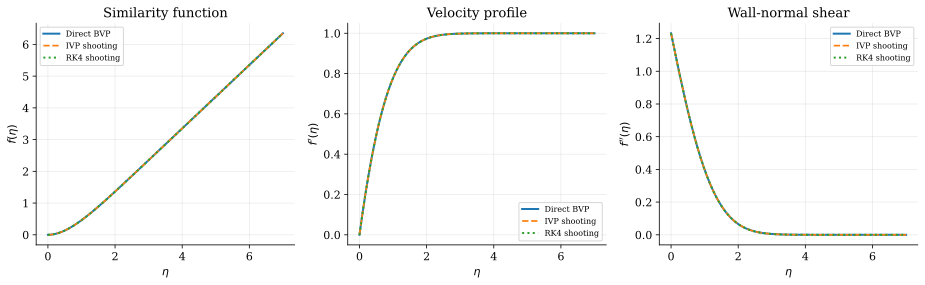
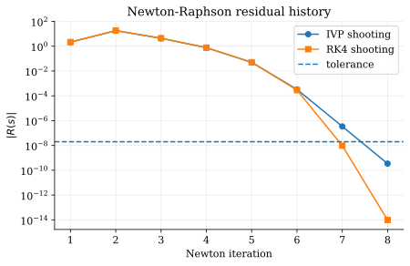
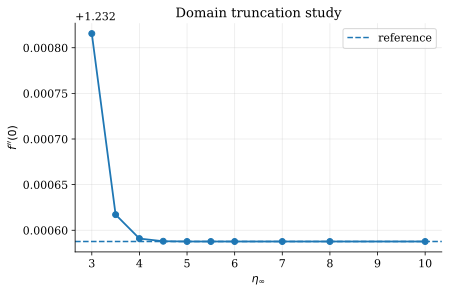
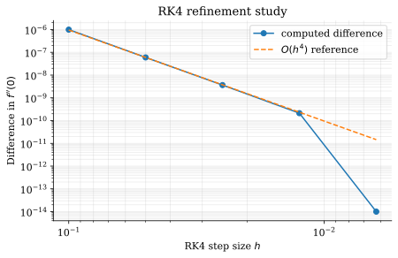
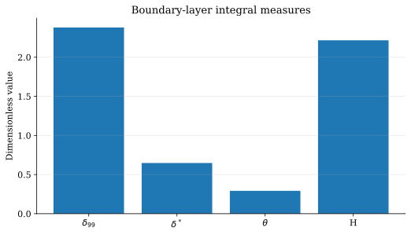
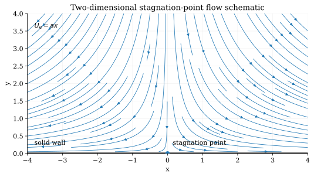

# Assignment 01 - Stagnation-Point Boundary Layer

**Student:** Pratyush Singh Parmar  
**Roll No.:** 24JE0314

This repository contains a reproducible numerical study of the Hiemenz/Falkner-Skan stagnation-point boundary-layer problem.

## Problem

Solve

`f''' + f f'' - (f')^2 + 1 = 0`

with

`f(0) = 0`, `f'(0) = 0`, and `f'(eta_inf) = 1`.

The primary MATLAB submission uses `eta_inf = 6` (N = 1000, h = 0.006), matching the bisection + RK4 calculation used for the print-ready assignment. The Python verification study uses `eta_inf = 7` for additional numerical checks.

## Submission method

The print-ready assignment uses **Bisection shooting + classical fourth-order RK4**, with the unknown `f''(0)` determined from the outer condition `f'(6) = 1`. The cleaned MATLAB implementation is `StagnationPointFlow.m`.

## Verification methods

1. **Direct BVP collocation** - solves the complete boundary-value problem.
2. **IVP shooting + Newton-Raphson** - treats `f''(0)` as the unknown shooting parameter.
3. **Fixed-step RK4 + sensitivity equation** - an independent explicit integrator with propagated Newton derivative.

These Python methods are retained as independent verification; they are not required for the basic printed submission.

## Repository structure

```text
Assignment_01_24JE0314/
├── README.md
├── StagnationPointFlow.m   # primary MATLAB submission method
├── requirements.txt
├── run_study.py
├── generate_figures.py
├── results.csv
├── methods/
│   ├── direct_bvp.py
│   ├── shooting.py
│   └── rk4_shoot.py
├── report/
│   ├── report.md
│   └── report.tex
├── figures/
│   ├── solution_profiles.*
│   ├── newton_convergence.*
│   ├── domain_truncation.*
│   ├── rk4_refinement.*
│   ├── wall_shear_error.*
│   ├── boundary_layer_measures.*
│   └── stagnation_flow_schematic.*
└── .github/workflows/generate-submission.yml
```

## Reproduce the results

```bash
pip install -r requirements.txt
python run_study.py
python generate_figures.py
```

The figure generator writes PNG and SVG versions of the plots and a numerical `results.csv` table. GitHub Actions reproduces the same figures and results table automatically.

## Key numerical result

The three methods converge to the same wall-shear parameter:

| Method | f''(0) |
|---|---:|
| Direct BVP | 1.232587656759 |
| IVP + Newton | 1.232587656723 |
| RK4 + sensitivity | 1.232587656595 |
| Reference | 1.232587660000 |

The RK4 solution gives approximately:

- `delta_99 = 2.37946`
- `delta* = 0.647917`
- `theta = 0.292328`
- `H = 2.21641`

## Figures

### Similarity solution



### Newton convergence



### Domain truncation



### RK4 refinement



### Boundary-layer quantities



### Flow configuration



## Report

The detailed technical report is available as `report/report.md`. A submission-ready PDF is also provided with this response from the same numerical results.
